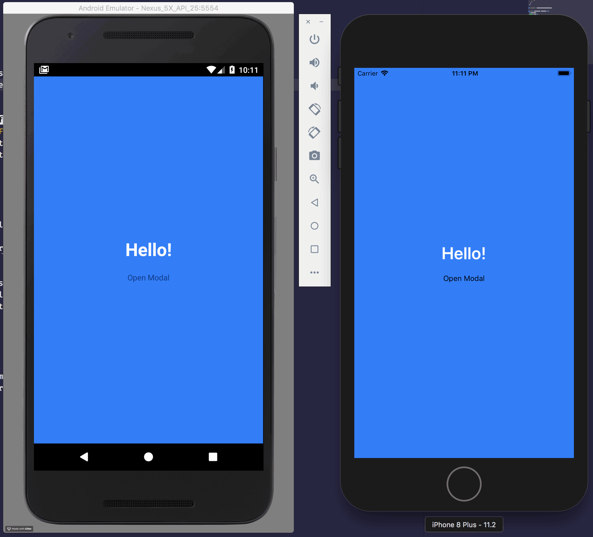

# `[@bs.module "react-native-navigation"]`


BuckleScript bindings for [`react-native-navigation`](https://wix.github.io/react-native-navigation/) (from [@Wix](https://github.com/wix)).

### Getting started

(work in progress)

### Usage example

(work in progress)

`src/index.re`

```reason
open BsReactNativeNavigation;

type screenId =
  | Drawer
  | Welcome
  | Modal
  | LightBox;

let screenIdToJs = screenId =>
  switch screenId {
  | Drawer => "screen.drawer"
  | Welcome => "screen.welcome"
  | Modal => "screen.modal"
  | LightBox => "screen.lightbox"
  };

let screenId = name => screenIdToJs(name) |> Navigation.asScreenId;

let startApplication = () =>
  Navigation.(
    startSingleScreenApp(
      ~screen=Screen.make(~screen=screenId(Welcome), ()),
      ~drawer=
        Drawer.(
          config(
            ~left=make(~screen=screenId(Drawer), ()),
            ~animationType=Animation.Parallax,
            ()
          )
        ),
      ~animationType=Animation.SlideDown,
      ()
    )
  );
```

`index.js`

```js
import { registerScreens, startApplication } from './lib/js/src'

registerScreens()
startApplication()
```

### Status

Check the current status [here](STATUS.md).



### Disclaimer

This is work in progress, use with caution.
